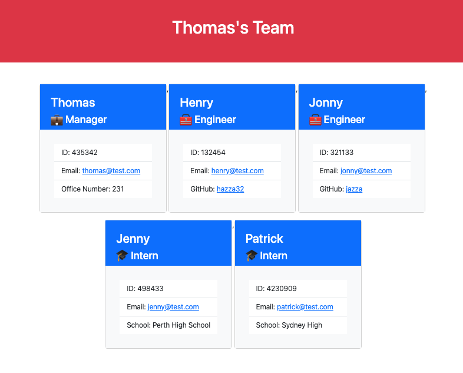

# Easy Team - Team Profile Generator 

## Description
This app creates a teamprofile HTML page from user given inputs. This app will store each team member's name, ID and email. The user can then specify the type of each team member as a manager, engineer or intern and specific inputs are given for each type. When the user is finished adding team member's a HTML file is generated from the team member data.

## Table of Contents
  [Description](#description)

  [Installation](#installation)

  [Tests](#tests)

  [Questions](#questions)
  
  [License](#license)

## Installation
Use git clone to make a copy of the repo. Once cloned use NPM install to download the required packages. The app can be run using node index.js.

## Tests
Using the Jest package use the command npm run test to run all test
## Questions
Created by [RyanMcd29](https://github.com/RyanMcd29).
If you have any questions about this project please contact me at [ryan.mcdiarmid45@gmail.com](mailto:ryan.mcdiarmid45@gmail.com).

## License
Licensed for use under <a href=https://opensource.org/licenses/MIT>MIT</a> for more information please see [license](./license) in repo.

